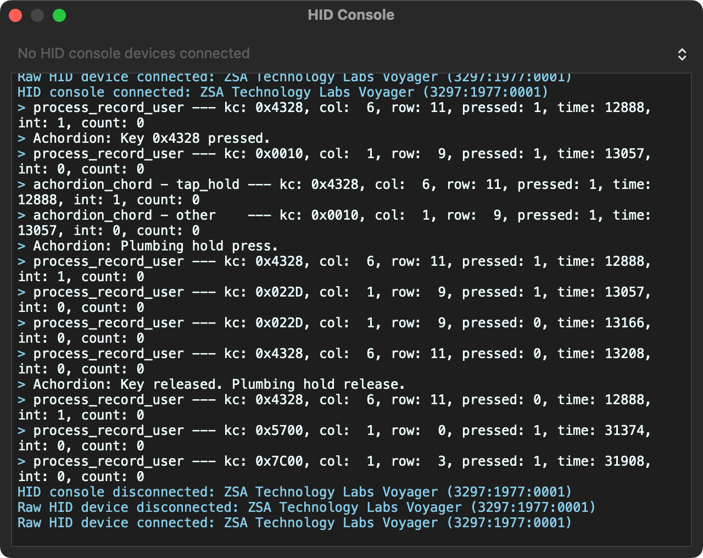

# My ZSA Voyager Keymaps

This repo contains keymaps for my ZSA Voyager. There's a branch for each keymap:

- [`default`](https://github.com/unindented/zsa-keymaps/tree/default): The default keymap of my ZSA Voyager.
- [`home-row-mods`](https://github.com/unindented/zsa-keymaps/tree/home-row-mods): A HMR keymap for my ZSA Voyager. _This is the one I'm currently using._

## My current keymap


## Making changes

### Via Oryx

If I make a change via Oryx, I then go on GitHub and [run the "Update from Oryx" workflow manually](https://github.com/unindented/zsa-keymaps/actions/workflows/update-from-oryx.yml). It'll fetch the latest changes from Oryx, merge them, build everything, and create a release with the generated artifacts.

### Via code

If I make a change in code, I just push it. If I want to create a release, then I go on GitHub and [run the "Build" workflow](https://github.com/unindented/zsa-keymaps/actions/workflows/build.yml), making sure to check the `create_release` checkbox.

When I'm trying things locally, I can run `make all` to build everything, but, since it needs to set everything up from scratch, it can take a while. So instead of that, what I tend to do is start an interactive shell:

```
docker build --tag qmk .
docker run -it --rm --volume ./build:/root/build --volume ./kmdrawer:/root/kmdrawer --volume ./src:/root/src qmk /bin/bash
```

And run the following:

```
git clone --branch firmware24 --single-branch --recursive https://github.com/zsa/qmk_firmware.git qmk_firmware \
  && cp qmk_firmware/keyboards/zsa/voyager/keyboard.json build/keyboard.json \
  && rm -rf qmk_firmware/keyboards/zsa/voyager/keymaps/JqNpm \
  && cp -r src qmk_firmware/keyboards/zsa/voyager/keymaps/JqNpm \
  && cd qmk_firmware \
  && qmk setup -y -b firmware24 zsa/qmk_firmware \
  && qmk compile -km JqNpm -kb zsa/voyager \
  && mv zsa_voyager_JqNpm.bin ../build/keymap.bin
```

Anytime I need to rebuild, I run these commands:

```
rm -rf keyboards/zsa/voyager/keymaps/JqNpm \
  && cp -r ../src keyboards/zsa/voyager/keymaps/JqNpm \
  && qmk compile -km JqNpm -kb zsa/voyager \
  && mv zsa_voyager_JqNpm.bin ../build/keymap.bin
```

## Debugging

To debug:

1. Set `CONSOLE_ENABLE = yes` in `rules.mk`.
2. Add the line `debug_enable = true;` to `keyboard_post_init_user` in `keymap.c`.
3. Build and flash to the keyboard.
4. Open QMK Toolbox, and click on Tools > HID Console.

You'll see some debug messages:



For more info, see [QMK's debugging FAQ](https://docs.qmk.fm/faq_debug).
